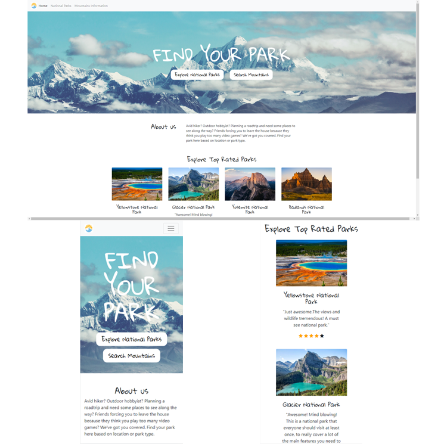
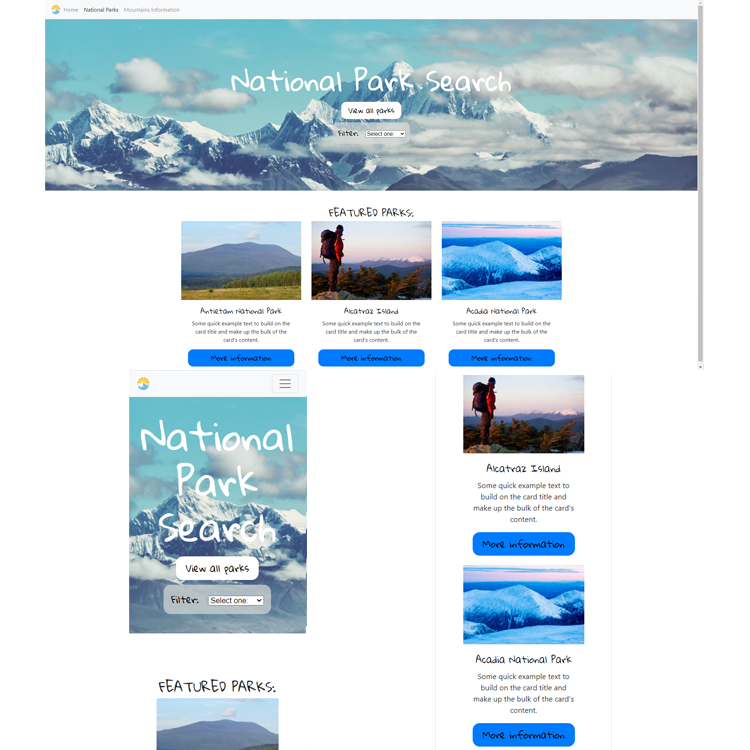
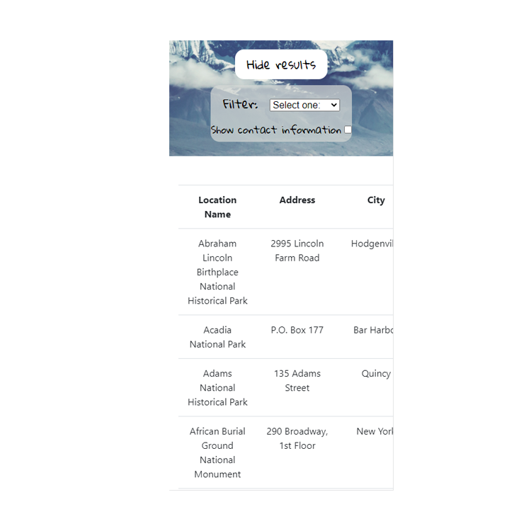
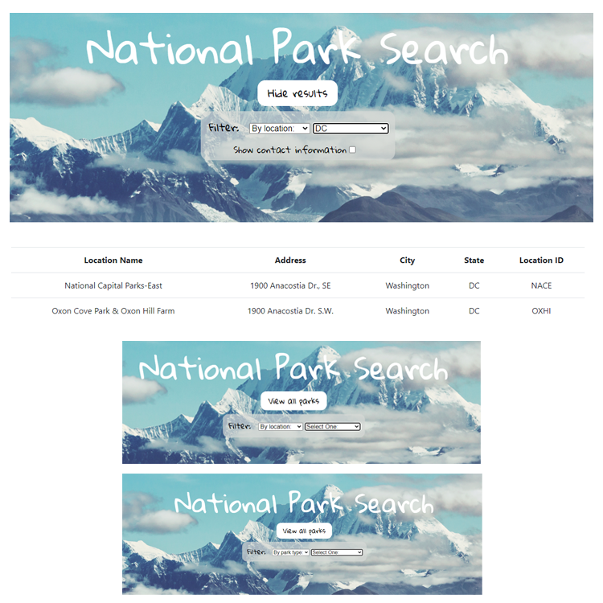
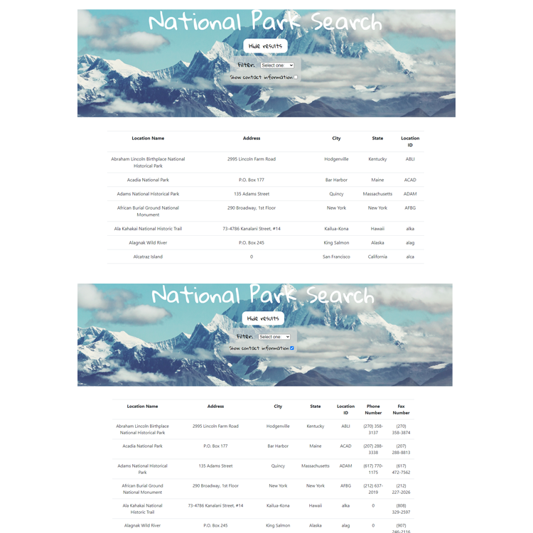
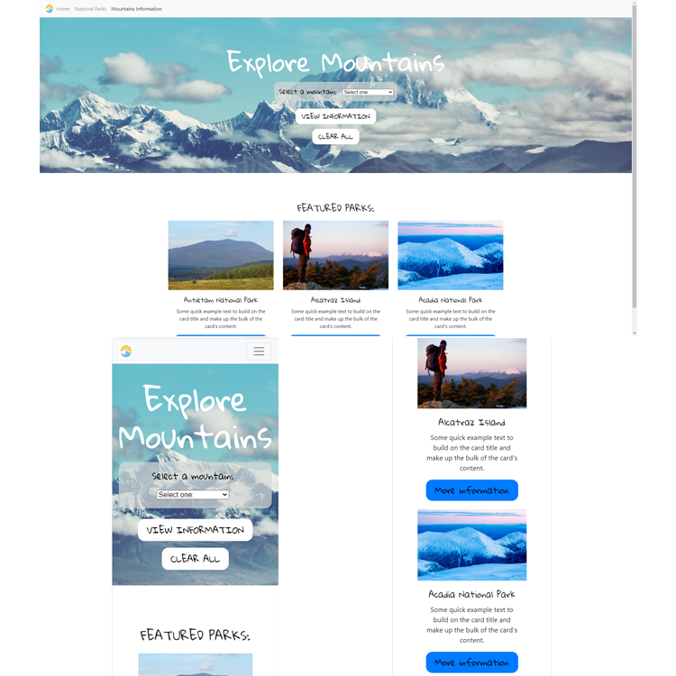
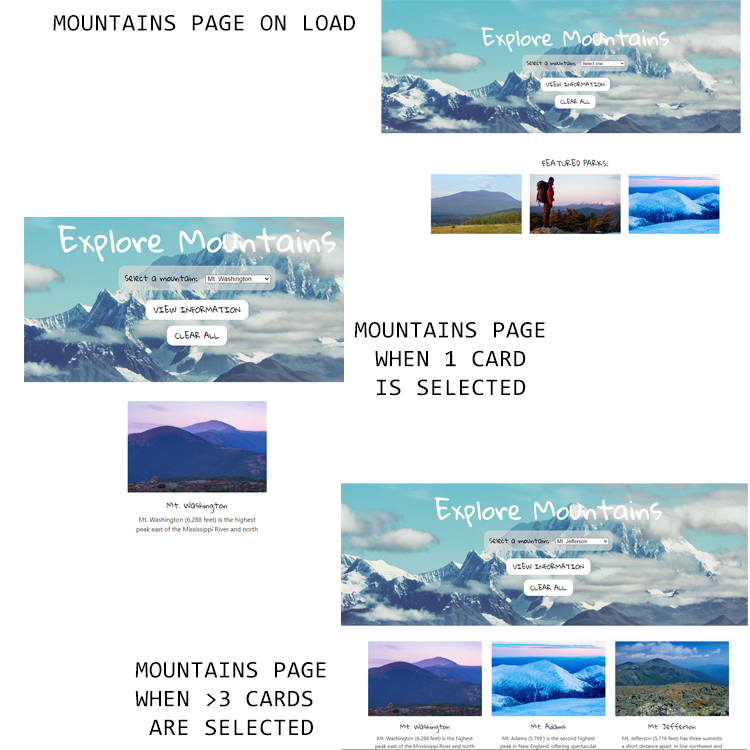
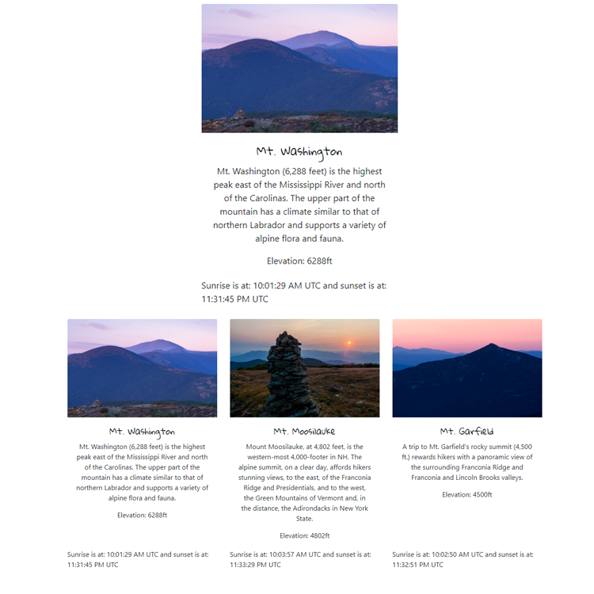

# About the project
For when your friends force you to leave the house.

For this project, I built a website that helps a user find things to do to enjoy the great outdoors. The site specializes in finding national parks to enjoy and mountains to climb.
The website includes:
1. A home page that highlights the simple organization that contains links to two pages: a national parks search page and a mountains information page.
2. A national parks search page that provides a user interface that allows the user to search for the park that is just right for them. Data comes from a file on the server named nationalparks.json.
3. A mountains information page that provides a user interface that allows the user to explore the details of 48 different mountains. Data comes from a file on the server named mountains.json.
4. A faveicon

## Technologies

* HTML
* CSS
* Bootstrap
* JavaScript

## Updates

:bulb: I'm currently working on :bulb:

* Displaying sunrise and sunset time locally to the mountain selected.

:pushpin: Planned Updates :pushpin:

* Additional search filters

## Demo

As with our last project, I wanted to keep the design minimal in order to spend more time coding user interface. The home page includes two links that will lead the user to their respective pages. 

### Home Page

The home page is simple and really only serves to prompt users to use the website's search pages. Personally, I like the little touch of star ratings on the "top rated parks" section.

### National Parks Page

The National Park search page features a search function on top and featured parks below on load. The page is responsive to device size.

The loaded data table of parks is also responsive and allows users to scroll horizontally in smaller devices.

* View all parks/Hide results button
    * Users may click view all to populate all available parks in the data
    * View all will change to hide results when a table is loaded
    * If users return to "Select one:" for either the first or second drop down list, the loaded table will disappear and thus hide the hide results button and show the view all button

* Filter search
    * Users may search either by park location or park type
    * Reverting back to "Select one:" on either drop down list will hide the table data as well as the "Show contact information" checkbox
    * Location name, address, city, state, and ID will populate by default

* Show contact information checkbox
    * Table will hide/show phone and fax data upon checking
    * The checkbox will only load once the second filter is chosen or when "view all" is selected
    * The checkbox will disappear upon return to a "Select one:" option or when "hide results" is clicked

### Mountains Page

The Mountains Information page provides a drop down list of the 48 parks listed in mountains.json. When the user selects a park, the page will display a bootstrap card with the name of the park, the description, an image of the park, the elevation, and the sunrise and sunset time in UTC.

The bootstrap cards with the mountains will load centered on the page, with a max of three cards per row. I have also included a filter to prevent users from reloading information about an already selected mountain. Since I dynamically created my bootstrap cards, they are also set to be responsive and stack as a column when viewed on small devices.

## Contact
Pull if you dare.

Nicole Rivera - 

